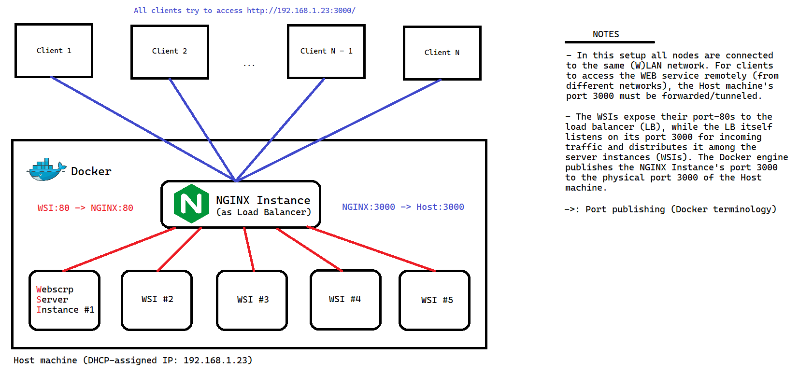

# Website Scraper (WebScrp)

## Какво представлява уеб апликацията?
Апликацията предоставя услугата да се извлече цялото количество информация и снимки от подаден линк

## Какви технологии използваме?
* HTML + CSS
* Javascript
* Docker
* NGINX
* Go

## Изображение на архитектурата


## Nginx
* Nginx Load Balancer е функционалност на Nginx, която позволява на системен администратор да балансира трафика между няколко уеб сървъра в една група за постигане на висока производителност и надеждност. Това е често използвано решение за уеб сайтове или приложения с голям брой потребители, където е нужно да се избегне еднократното претоварване на определен уеб сървър и да се гарантира висока наличност и отзивчивост на системата.

## Docker Compose
* Docker Compose е инструмент за дефиниране и управление на множество Docker контейнери като едно приложение. Той позволява на потребителите да дефинират всички контейнери, необходими за едно приложение, в един конфигурационен файл и да ги стартират и спират лесно чрез единствена команда.

## Инсталация и активиране
1. Клонирате репозиторията.
2. Активирате Docker engine-a (т.е. Docker daemon-a/демона трябва да работи).
3. Отваряте инстанция на командния прозорец на Вашата операционна система в директорията 'vot-project-web-scraper'.
    - За Windows тази стъпка може да се избегне. Отивате в 'scripts' директорията и изпълнявате 'setup.bat' и 'start.bat' последователно!
4. Нататък действията Ви зависят от операционната Ви система.

### Windows
```bat
CMD> cd scripts
CMD> setup.bat
...
CMD> start.bat
```

### Linux
```sh
$> cd scripts
$> $(cat setup.bat)
...
$> $(cat start.bat)
```

След като всеки контейнер в клъстера се активира, можете да отворите WEB приложението на `http://localhost:3000/`.

## Отбор
- Кристиан Милчев
- Мартин Карабонев
- Мартин Наков
- Михаил Василев
